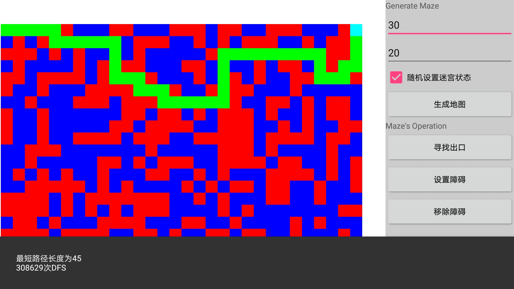
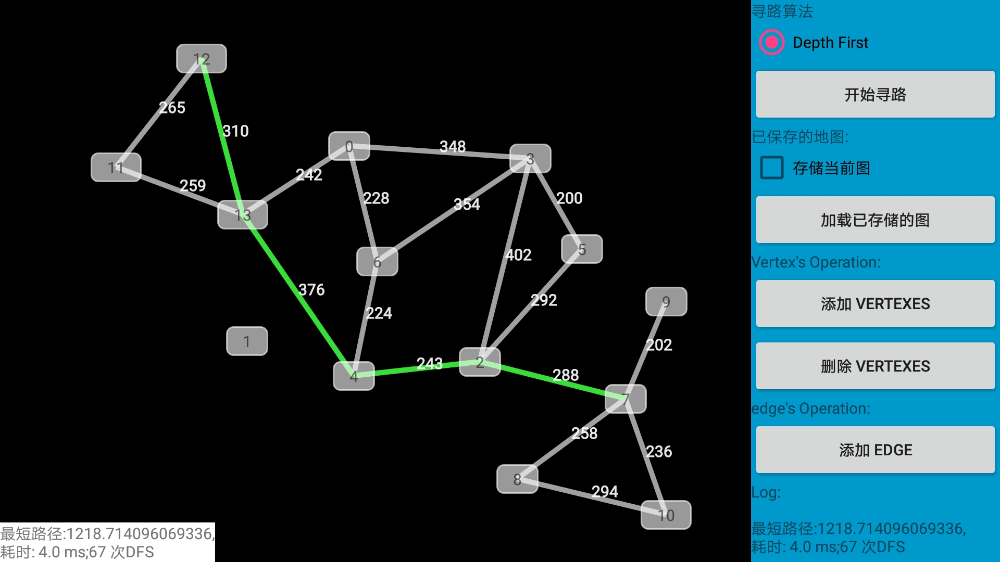

# android-shortest-path-gui
本项目是一个安卓应用，是我年轻的时候（大二）做的迷宫和无向图求最短路径的图形化小玩具，虽然现在看代码写的不怎么样，但好歹也是个回忆，所以放到github上来纪念一下。

PS：当年把这个当数据结构课设作品保平竟然还不相信是我做的hhh（当时还没开java的课）

无向图求最短路径的功能有dijkstra和dfs算法两种算法，但是dijkstra求路径略麻烦，所以当时就只设置了dfs的选项

# 迷宫求最短路径
测试的话请开随机生成地图，当初做的时候直接无脑dfs，如果图没有障碍的话会爆炸

# 无向图求最短路径

# 扫描二维码

